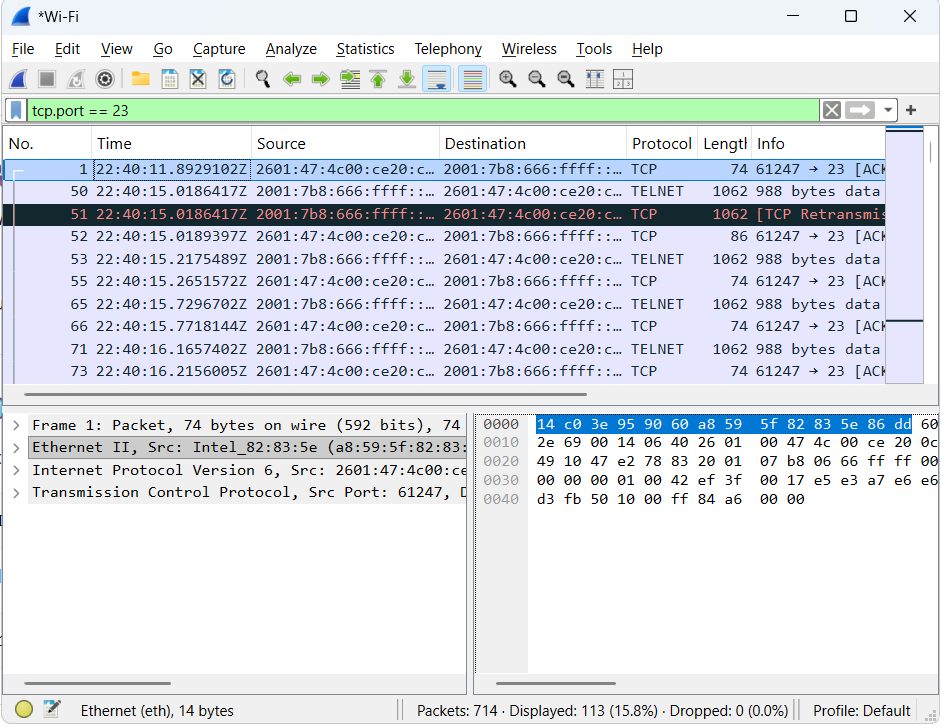
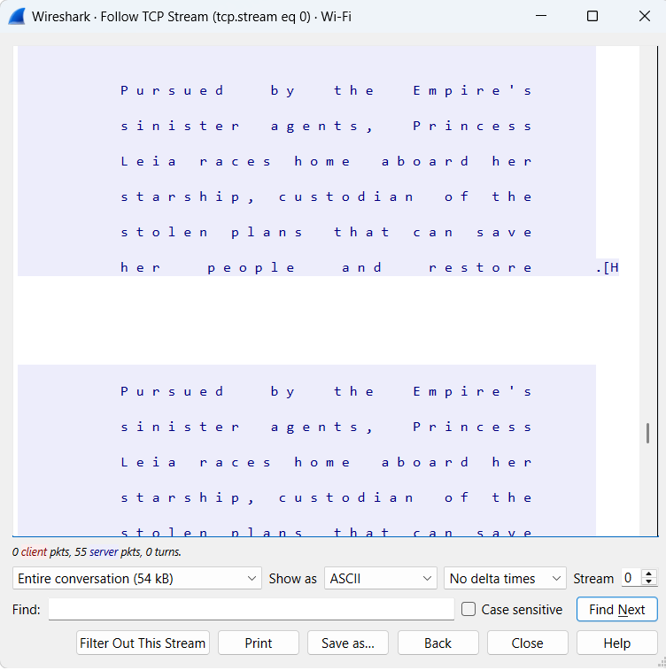
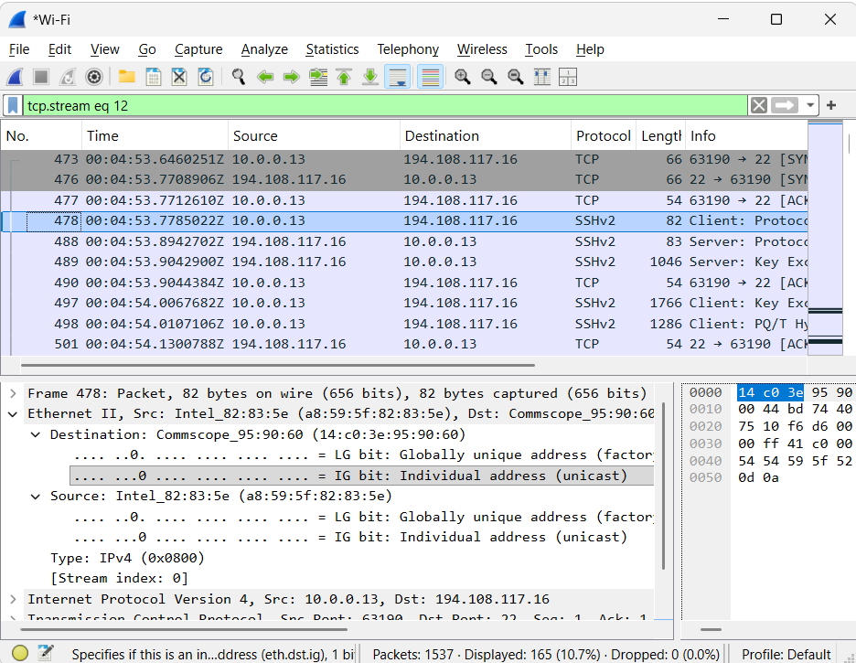
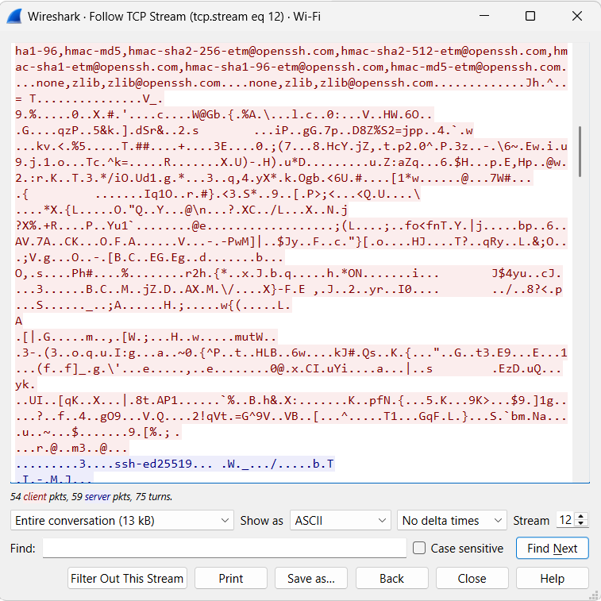

# Telnet vs SSH Wireshark Lab

## Overview
In this lab, I analyzed the security differences between Telnet and SSH by capturing and inspecting network traffic using Wireshark. The objective was to demonstrate how Telnet transmits data in plaintext, while SSH encrypts all communication to protect sensitive information.

This project highlights a critical cybersecurity concept: insecure protocols like Telnet can expose credentials, while secure protocols like SSH prevent interception through encryption.

---

## Objectives
- Capture Telnet traffic using Wireshark  
- Identify plaintext data within Telnet sessions  
- Capture SSH traffic using Wireshark  
- Analyze encrypted SSH communication  
- Compare security differences between Telnet and SSH  

---

## Tools Used
- Wireshark  
- PuTTY  
- Telnet  
- SSH (SSHv2)  
- Windows Environment  

---

## Lab Methodology

### Telnet Traffic Analysis
I initiated a Telnet session while capturing traffic in Wireshark.

Filter used: `tcp.port == 23`

I used the Follow TCP Stream feature to reconstruct the session.

**Findings:**
- Credentials and commands were visible in plaintext  
- Entire session was readable  
- Demonstrates lack of encryption and high security risk  

---

### SSH Traffic Analysis
I initiated an SSH session using PuTTY and captured the traffic in Wireshark.

Filter used: `tcp.port == 22`

I analyzed packets and followed the TCP stream.

**Findings:**
- Traffic appeared as unreadable, encrypted data  
- Observed protocol negotiation and key exchange  
- No credentials or commands visible  
- Demonstrates secure encrypted communication  

---

## Key Differences

| Feature | Telnet | SSH |
|--------|--------|-----|
| Encryption | ❌ None | ✅ Encrypted |
| Credential Exposure | ❌ Yes | ✅ No |
| Security Level | Low | High |
| Recommended Use | Never | Always |

---

## Screenshots

### Telnet Packet Capture

### Telnet TCP Stream (Plaintext Exposure)

### SSH Packet Capture

### SSH TCP Stream (Encrypted Data)

---

## Security Takeaways
Telnet is insecure because it transmits data in plaintext, making it vulnerable to packet sniffing and credential theft.

SSH encrypts all communication, ensuring that intercepted traffic cannot be read. This makes SSH the standard for secure remote access.

---

## Skills Demonstrated
- Network traffic analysis  
- Packet capture and filtering  
- Wireshark TCP stream analysis  
- Understanding of secure vs insecure protocols  
- Cybersecurity fundamentals  
- Encryption vs plaintext data analysis  

---

## Project Summary
This project demonstrates the practical differences between Telnet and SSH by analyzing real network traffic. Telnet traffic was fully readable, exposing sensitive data, while SSH traffic was encrypted and secure.
